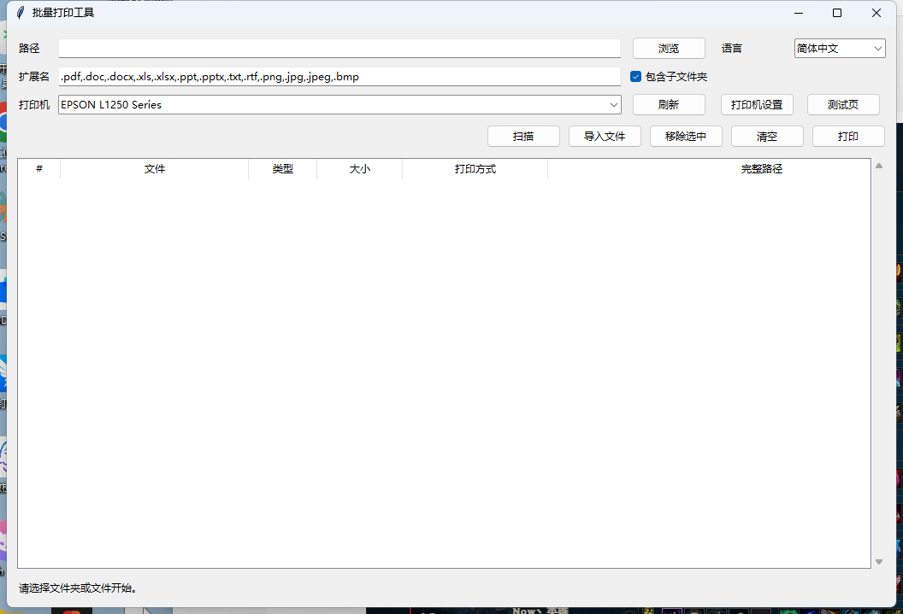
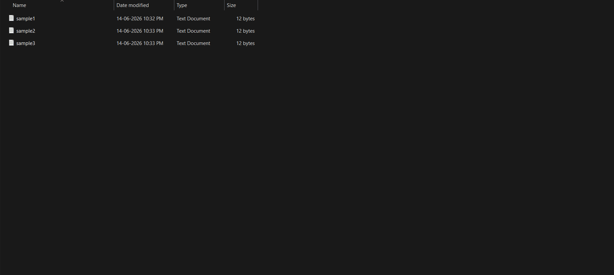
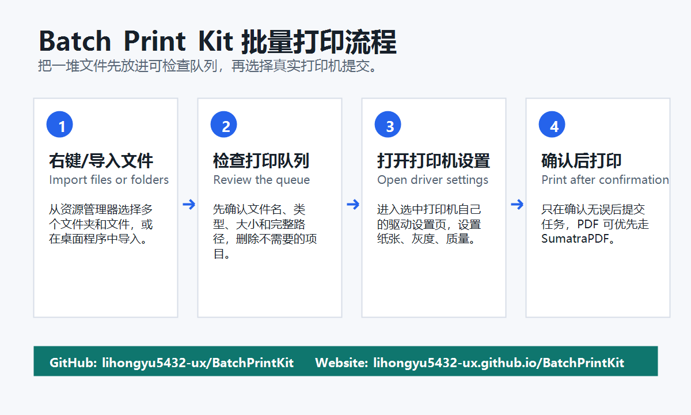

# Batch Print Kit 批量打印工具

[](https://github.com/lihongyu5432-ux/BatchPrintKit/actions/workflows/test.yml)
[](https://github.com/lihongyu5432-ux/BatchPrintKit/releases/latest)
[](LICENSE)

[English](README.md) | 简体中文

一个开源的 Windows 批量打印工具，支持桌面界面、右键菜单、打印机选择、队列预览和 PDF 优先打印。

[产品页](https://lihongyu5432-ux.github.io/BatchPrintKit/) · [下载](https://github.com/lihongyu5432-ux/BatchPrintKit/releases/latest) · [反馈](https://github.com/lihongyu5432-ux/BatchPrintKit/issues)





## 适合谁

适合经常在 Windows 上批量打印文件的人：

- 办公室批量打印 PDF、Word、Excel、图片
- 仓库/门店打印订单、标签、表格
- 学校/培训机构打印资料包
- 需要从资源管理器右键选中很多文件或文件夹后统一打印

## 主要功能

- 扫描文件夹并按扩展名筛选
- 支持一次导入多个文件
- 打印前先看到完整队列，可以移除选中项或清空
- 可选择真实打印机，尽量避免误选 WPS PDF / Microsoft Print to PDF
- `打印机设置` 会打开选中打印机自己的驱动设置页面，可设置纸张、灰度/彩色、质量、双面、纸盒等
- PDF 可使用内置 SumatraPDF 打印，减少被 WPS 接管的问题
- 支持 Windows 右键菜单和 Send To 快捷入口
- MIT 协议，可自由使用、修改和二次开发

## 直接下载

普通 Windows 用户下载 Release 里的压缩包即可：

[下载 BatchPrintKit-v0.2.0-win64.zip](https://github.com/lihongyu5432-ux/BatchPrintKit/releases/download/v0.2.0/BatchPrintKit-v0.2.0-win64.zip)

下载后解压，运行：

```text
BatchPrintKit.exe
```

如果你使用 Scoop，也可以添加 bucket 后安装：

```powershell
scoop bucket add lihongyu https://github.com/lihongyu5432-ux/scoop-bucket
scoop install batch-print-kit
```

## 从源码运行

```powershell
git clone https://github.com/lihongyu5432-ux/BatchPrintKit.git
cd BatchPrintKit
python -m pip install -e .
batch-print-gui
```

不安装也可以本地运行：

```powershell
$env:PYTHONPATH="src"
python -m batch_print_kit.gui
```

## 安装右键菜单

```powershell
powershell -ExecutionPolicy Bypass -File scripts\install_sendto_shortcut.ps1
powershell -ExecutionPolicy Bypass -File scripts\install_context_menu.ps1
powershell -ExecutionPolicy Bypass -File scripts\enable_classic_context_menu.ps1
```

之后在资源管理器里选中文件/文件夹，右键选择：

```text
用批量打印工具打开
```

更完整的 Windows 11 原生右键菜单安装方式见 [docs/usage.md](docs/usage.md)。

## 构建 exe

```powershell
powershell -ExecutionPolicy Bypass -File scripts\install_sumatra_pdf.ps1
powershell -ExecutionPolicy Bypass -File scripts\build_windows_exe.ps1
```

生成位置：

```text
dist\BatchPrintKit\BatchPrintKit.exe
```

## 注意

Windows 上不同文件类型的打印最终仍依赖对应应用或打印机驱动。PDF 优先使用 SumatraPDF；Word/Excel/PPT 等文件通常由系统关联的 Office/WPS 打印。

如果某个文件打印异常，建议先在资源管理器里单独右键打印该文件，确认本机应用和打印机驱动支持它。

## 欢迎反馈

不同 Windows 版本、打印机型号、Office/WPS 环境差异很大。如果这个工具对你有用，欢迎点 star。

如果遇到问题，也欢迎提 issue，最好带上：

- Windows 版本
- 打印机型号
- 文件类型
- PDF 是否使用 SumatraPDF
- 失败时的截图或错误信息

## 许可证

MIT。详见 [LICENSE](LICENSE)。
